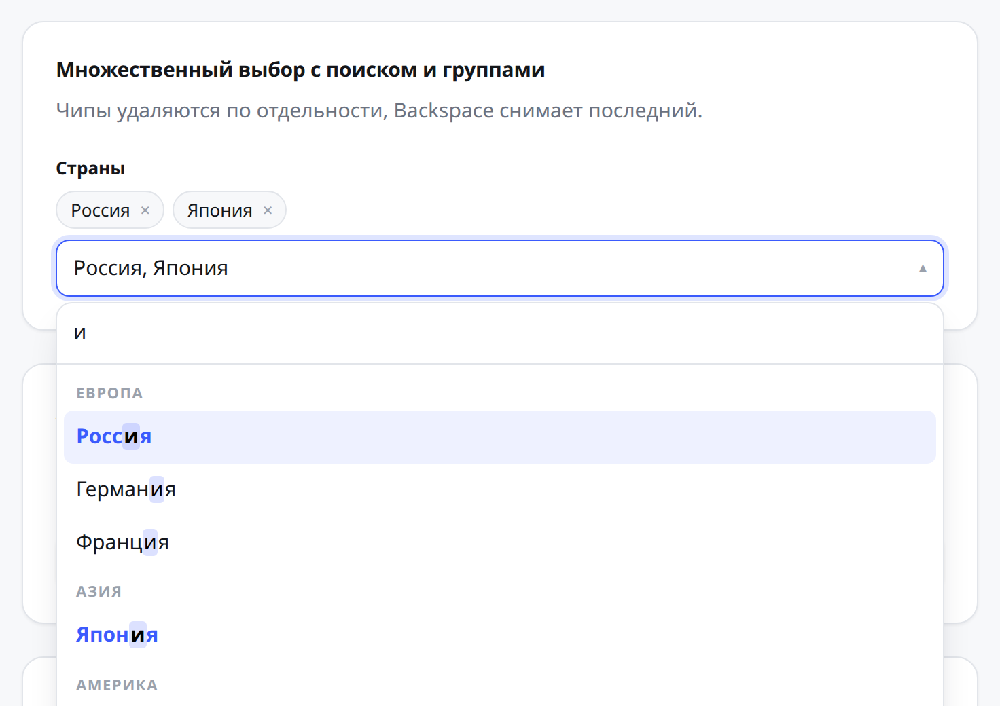
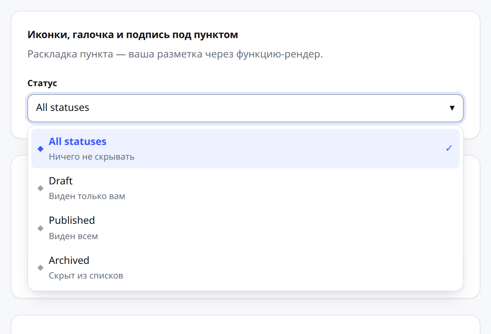
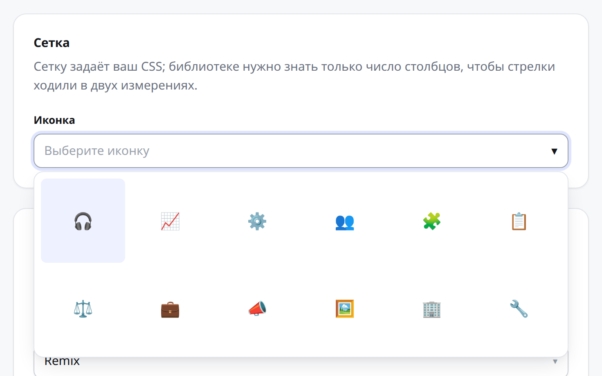
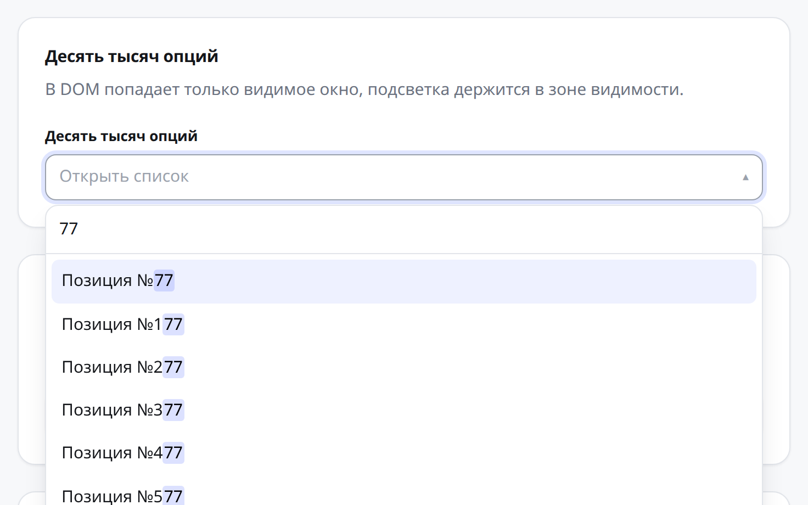
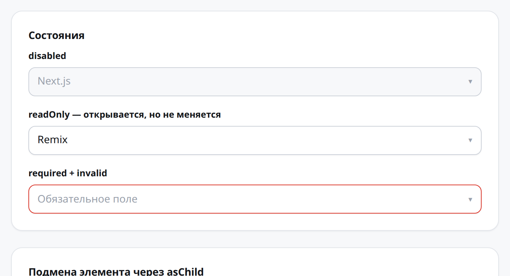
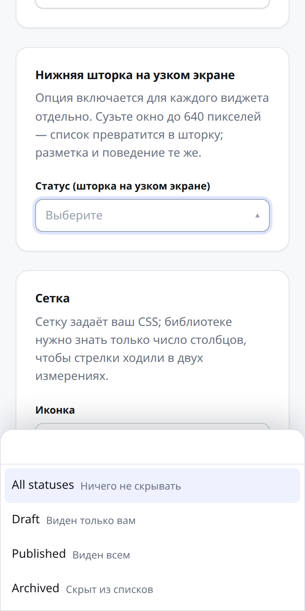
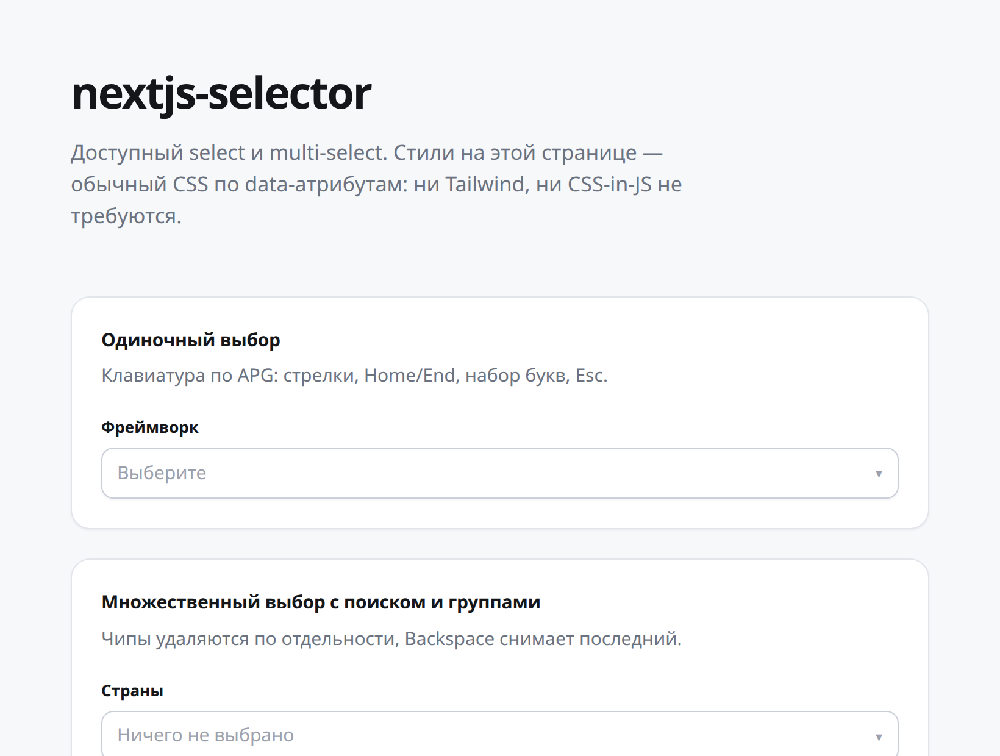

# nextjs-selector

[](https://github.com/Danetix-Labs/nextjs-selector/actions/workflows/ci.yml)

Accessible select and multi-select for React and Next.js. Behaviour, keyboard
and ARIA are the library's job; the looks are yours.

**Русская версия — [README.ru.md](./README.ru.md)**



```bash
npm install nextjs-selector
```

```tsx
'use client'

import { MultiSelect } from 'nextjs-selector'

;<MultiSelect options={countries} label="Countries" searchable />
```

Only `options` is required. Search, chips, empty state, loading and error
indicators are switched on by flags.

## Why another one

| | nextjs-selector | react-select | Radix Select |
| --- | --- | --- | --- |
| Bundle | **7 kB brotli** | ~29 kB gzip | ~29 kB gzip |
| Multi-select with search | **built in** | yes | not provided |
| Virtualization | **built in** | add-on | no |
| Server Actions without JS | **yes** | no | no |
| Bottom sheet on phones | **opt-in** | no | no |
| Runtime dependencies | **none** | 9 | 22 |

Opening a list of 10 000 options takes **44 ms** and keeps **14 nodes** in the
DOM; `react-select` spends seconds on the same data.

## What it does

**Rich items** — icons, ticks and a second line, laid out by your own render
function.



**Grids** — the CSS is yours; the library only needs the column count so arrows
move in two dimensions.



**Ten thousand options** — only the visible window reaches the DOM, and the
highlight stays in view.



**States** — `disabled`, `readOnly`, `required` and `invalid`, announced through
ARIA and exposed as data-attributes.



**Bottom sheet.** On narrow screens a dropdown is the wrong shape: small targets
and a list fighting the on-screen keyboard. Turn it on per widget — off by
default, because presentation is a product decision.

```tsx
<Select options={options} label="Status" sheet />
```



Also: option groups, removable and reorderable chips, creating options on the
fly, async sources with cursor pagination, match highlighting, selection limits,
pinned values, undo, hidden form fields for Server Actions, and `asChild` for
swapping any element.

## Entry points

| Import | What is inside | Where it runs |
| --- | --- | --- |
| `nextjs-selector` | components plus the headless layer | Client Components |
| `nextjs-selector/headless` | hooks, no markup | Client Components |
| `nextjs-selector/core` | the state machine, no React | anywhere, RSC included |

`core` carries neither `'use client'` nor a React import, so filtering, state
transitions and window maths can run on the server. CI proves it by executing
that entry under `--conditions=react-server`.

## Documentation

- [Getting started](./docs/en/getting-started.md) — installation, the common case, styling
- [API reference](./docs/en/api.md) — every component, hook and option
- [Recipes](./docs/en/recipes.md) — async sources, forms, cascades, tabs
- [Accessibility](./ACCESSIBILITY.md) — automated checks and the manual protocol

Russian: [начало работы](./docs/ru/getting-started.md) ·
[справочник API](./docs/ru/api.md) · [рецепты](./docs/ru/recipes.md)

## Styling

State is expressed as data-attributes, so any way of writing CSS works —
Tailwind is optional, not assumed.

```css
[data-part='option'][data-highlighted] { background: #eef1ff; }
[data-part='option'][data-selected]    { font-weight: 600; }
[data-part='trigger'][data-state='open'] { border-color: #3b5bfd; }
```

```tsx
<Select.Item className="data-highlighted:bg-indigo-50" />
```

Parts: `root`, `label`, `control`, `trigger`, `value`, `chips`, `chip`,
`content`, `search`, `listbox`, `group`, `option`, `header`, `footer`,
`announcer`. States: `data-state`, `data-side`, `data-mode`,
`data-highlighted`, `data-selected`, `data-disabled`, `data-invalid`,
`data-required`, `data-readonly`, `data-multiple`.

An optional stylesheet handles positioning only — no colours, no typography:

```ts
import 'nextjs-selector/styles.css'
```

## Quality

```
230 unit tests + 25 browser scenarios across Chromium, Firefox and WebKit
axe audits on every feature set, including RTL
Node 18 / 20 / 22 / 24 · Next.js 14 / 15 / 16 · App and Pages Router
```

WCAG 2.2 AA is **not** claimed: automated audits catch structural mistakes but
cannot tell whether the widget is usable by ear. The manual protocol lives in
[ACCESSIBILITY.md](./ACCESSIBILITY.md).

## Demo



```bash
cd examples/demo
npm install
npm run dev
```

## Development

```bash
npm install
npm run test        # vitest
npm run test:e2e    # playwright
npm run check       # lint, types, tests, build, exports, size
```

Building requires Node.js `^22.18.0 || >=24.11.0` — a tsdown requirement.

## License

[MIT](./LICENSE) © Danetix-Labs
